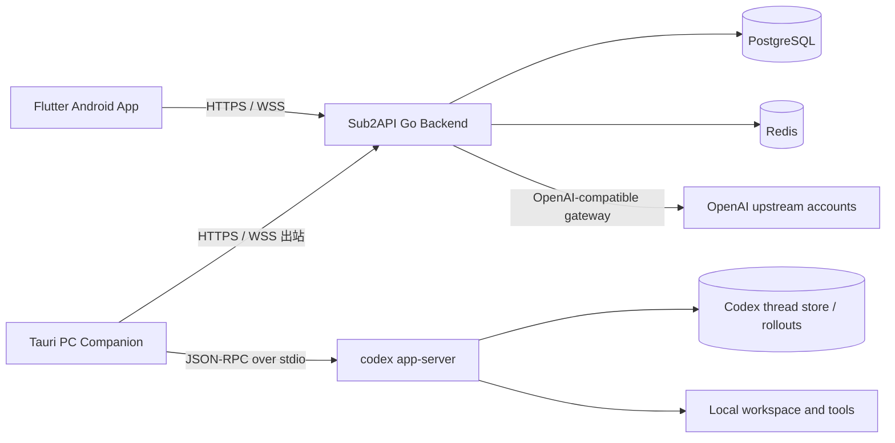
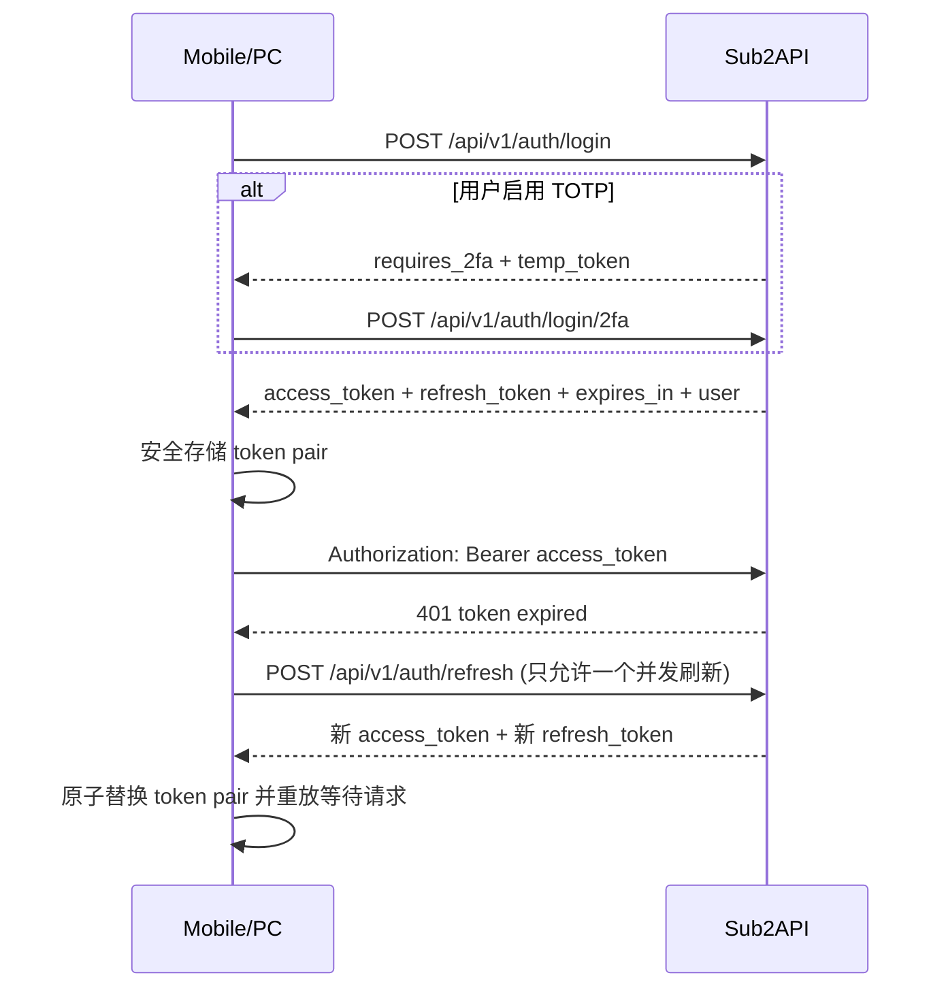
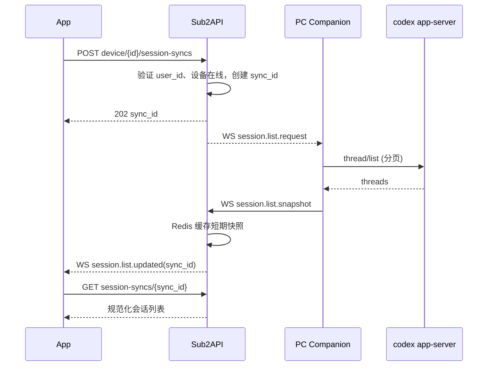
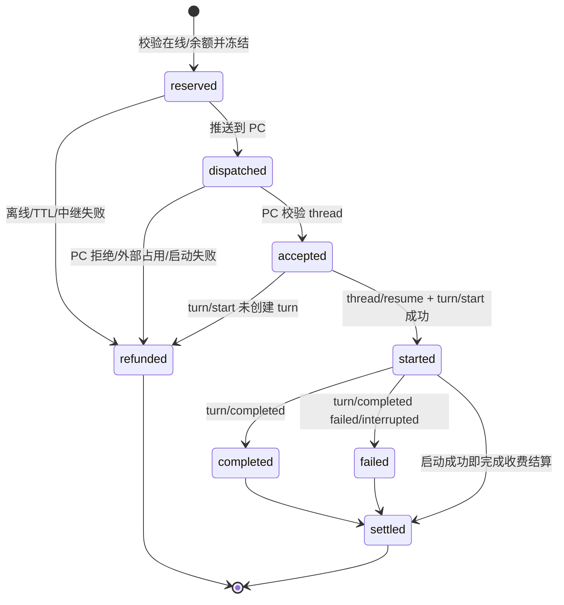
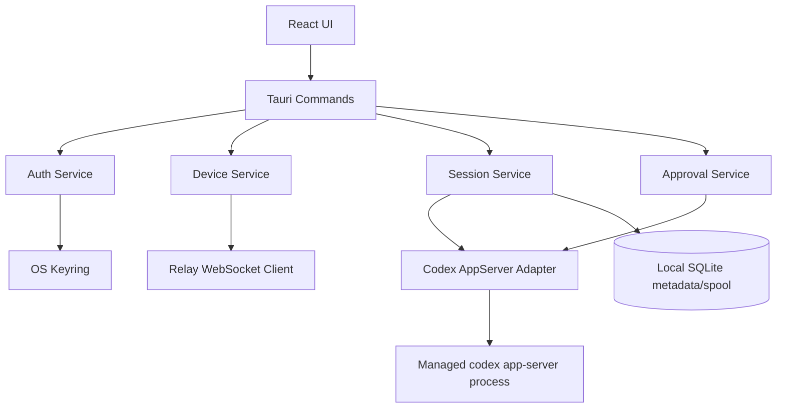

# 系统与软件架构

## 1. 架构决策摘要

| 决策 | 选择 | 原因 |
|---|---|---|
| 移动端 | Flutter + Riverpod + Dio + GoRouter | 符合既定技术栈，便于后续 iOS |
| 移动端组织 | Feature-First + Clean Architecture | 功能边界清晰，适合 AI 分里程碑生成 |
| PC 工具 | Tauri 2 + Rust + React/TypeScript | 与 cc-switch 类似，跨平台且能安全管理本地进程/Keyring |
| Codex 接入 | `codex app-server --stdio` JSON-RPC | 结构化、可流式、跟随本地 Codex 协议，不解析 TUI ANSI |
| 互联网链路 | App 和 PC 都主动连接 Sub2API | 不开放 PC 入站端口，适应 NAT/防火墙 |
| 实时传输 | HTTPS REST 做命令；WSS 做事件/中继 | REST 易做幂等和计费，WS 适合在线状态和流式事件 |
| 权威存储 | PostgreSQL 保存设备/任务/账本；Redis 保存在线路由和短暂 payload | 计费可靠，源码/会话内容最小化持久化 |
| 普通聊天历史 | 默认只保存在移动设备 | 不扩大 Sub2API 数据责任边界 |
| 协同计费 | 冻结 → 启动 turn 后结算 → 失败退款 | 防止重复扣费、离线误扣和免费执行 |
| 活跃会话冲突 | 只读、重试或显式 fork | 尊重 app-server thread 所有权，不破坏 rollout |

## 2. 总体架构



信任边界：

- App 只信任用户配置的 Sub2API HTTPS Origin。
- PC 只接收后端定义的协同协议，不接收任意 shell 命令。
- Sub2API 以 JWT 的 `user_id` 为唯一租户边界。
- app-server 仍然是本机文件、命令、审批和 Codex thread 的权威；PC 工具不能绕过其权限模型。

## 3. 核心业务流

### 3.1 登录与续期



移动端与 PC 必须使用独立 token pair。不要把移动端 Refresh Token复制给 PC，也不要用 API Key 代替面板 JWT 登录。

### 3.2 Key/分组与普通聊天

1. App 使用 JWT 拉取 `/keys` 和 `/groups/available`。
2. 先选 OpenAI 分组，再从已经绑定该分组的 Key 中选择。
3. 使用选中 Key 作为 `Authorization: Bearer sk-...` 调用 `/v1/models`。
4. 新建本地 conversation，保存 `site_id/key_id/group_id/model` 快照。
5. 文本请求调用 `/v1/responses` 并消费 SSE；实现层保留 Chat Completions adapter。
6. 消息和生成状态写入本地数据库；Key 只引用安全存储中的别名。

不要在同一 conversation 中静默改变 Key、group 或 provider。用户切换时默认创建新 conversation。

### 3.3 公告

1. App 冷启动登录完成、回前台、用户下拉刷新时调用 `/announcements`。
2. Store 先合并本地已展示集合，再选择最早的未读 `popup` 公告。
3. 用户点击“我知道了”后调用 `POST /announcements/{id}/read`。
4. 网络失败时本地记录 dismissed，后台重试 mark-read；下一次进程启动仍以服务端 read state 为准。

### 3.4 会话查询



PC 返回的是规范化 DTO，不返回本机 `source_path`、绝对 rollout 路径或环境变量。

### 3.5 会话消息同步

1. App 创建 thread sync request，携带 `after_item_id` 或本地 cursor。
2. PC 对未加载 thread 调用只读 `thread/read`；大历史优先分页 `thread/turns/list`/`thread/items/list`。
3. PC 将 app-server item 映射为移动 DTO：message、reasoning summary、command、file change、tool、approval、error。
4. 后端仅用 Redis 短暂中继/缓存，PostgreSQL 不保存正文。
5. App 以 `(device_id, thread_id, item_id)` 去重并写入本地数据库。

### 3.6 发送任务与计费



实现注意：业务状态和账务状态应分列。`command.status=completed` 不等于 `billing.status=settled`；状态转换由数据库 CAS/事务保护。

## 4. Flutter App 架构

### 4.1 分层规则

每个 feature 使用四层：

- `presentation`：页面、Widget、Riverpod controller/state、GoRouter route。
- `domain`：Entity、Value Object、Repository 接口、Use Case；不依赖 Dio/Flutter UI。
- `data`：DTO、Mapper、Remote/Local DataSource、Repository 实现。
- `application` 可选：跨多个 Use Case 的协调器。小 feature 可并入 presentation controller。

共享核心：

- `core/network`：两个 Dio client。Panel client 使用 JWT；Gateway client 使用 API Key。禁止在一个 interceptor 中混合两种凭证。
- `core/auth`：单飞 refresh、token rotation、站点隔离、登出广播。
- `core/realtime`：WSS 生命周期、heartbeat、重连、事件分发。
- `core/storage`：Secure Storage 保存 secret；Drift/SQLite 保存非 secret 业务数据。
- `core/router`：auth/user/admin 分支和深链守卫。
- `core/logging`：字段级 redact；release 默认不记 request/response body。

### 4.2 Riverpod 状态边界

- `activeSiteProvider`：当前站点 Origin 和站点 ID。
- `authSessionProvider`：未认证、登录中、待 2FA、已认证、刷新中、失效。
- `apiKeyCatalogProvider`：Key 列表和分组筛选；State 中只保留 Key ID/脱敏值。
- `selectedChatProfileProvider`：`keyId + groupId + model`。
- `conversationControllerProvider.family(conversationId)`：消息、流式 buffer、错误、停止句柄。
- `announcementControllerProvider`：公告、未读和 popup 队列。
- `deviceListProvider`：设备在线状态。
- `codexSessionListProvider.family(deviceId)`：同步任务、查询、分页。
- `codexThreadControllerProvider.family(ThreadRef)`：消息 cursor、实时事件、发送状态。

禁止在 Widget 中直接调用 Dio、Secure Storage 或 WebSocket。

### 4.3 GoRouter 路由

```text
/bootstrap
/site/setup
/auth/login
/auth/2fa
/app
  /chat
  /chat/:conversationId
  /images/new
  /announcements
  /collab/devices
  /collab/devices/:deviceId/sessions
  /collab/devices/:deviceId/threads/:threadId
  /profile
/admin                 # role=admin 才可进入
  /coming-soon         # MVP 占位
```

路由守卫顺序：站点是否有效 → token 是否可恢复 → 用户角色 → feature flag。禁止只在 UI 隐藏管理员入口而不做路由守卫。

### 4.4 本地数据

建议表：

- `sites`：origin、display_name、last_used_at；不存 token。
- `chat_conversations`：配置快照、标题、时间。
- `chat_messages`：role、content、status、remote_item_id、created_at。
- `generated_images`：task_id、local_path、prompt、model、status。
- `codex_thread_cache`：device/thread 元数据，不含本机路径。
- `codex_items`：已同步的规范化 item。
- `announcement_seen`：用于抑制同进程重复 popup，不替代服务端 read state。

Secure Storage key 必须包含站点 hash 和账号 user ID，防止站点切换串 token。

## 5. PC Companion 架构

### 5.1 进程结构



### 5.2 Codex adapter 职责

- 查找 `codex` binary，运行 `codex --version`。
- 可选运行 `codex app-server generate-json-schema` 到版本缓存目录，生成当前安装版本的 Schema。
- 启动 `codex app-server --stdio`，分离 stdout(JSONL) 与 stderr(log)。
- 完成 `initialize` request + `initialized` notification。
- 维护 JSON-RPC request ID → oneshot response map。
- 调用 thread/list/read/resume、turn/start/interrupt；消费 item/turn 和 server request。
- 将服务端请求（审批、request_user_input）交给 Approval Service。
- 子进程退出时标记设备 degraded，指数退避重启；正在执行的未确认任务交由后端退款/人工核对。

### 5.3 会话可写性

会话列表需要额外的 `write_state`：

- `writable_loaded`：由当前 Companion 的 app-server 加载且可接受 direct input。
- `writable_resumable`：未加载，但可尝试 resume。
- `busy_external`：另一个 app-server/Codex 进程拥有写锁。
- `read_only`：归档、子代理限制或协议不支持。
- `unknown`：只读 list 无法确定，发送前再次探测。

如果 `thread/read.canAcceptDirectInput=false`，不显示可写。若该字段为 null，仅允许在发送时尝试 resume，不提前承诺。

### 5.4 cc-switch 可复用思想

可以借鉴：

- 会话标题取显式 state DB title，退化到第一条用户消息和目录名。
- 过滤 subagent、环境注入和 AGENTS.md 注入，避免把它们作为标题。
- 只读扫描 sessions + archived_sessions 的兼容策略。
- 消息中把 function call/output 变成可折叠工具项。

不要直接复制：

- `source_path` 不能发给手机。
- `codex resume <id>` 只用于打开终端，不是结构化协同写入。
- 直接读取 JSONL 只作为 app-server 不可用时的只读降级，不能写回 JSONL。

## 6. Go 后端架构

### 6.1 模块边界

新增 `collaboration` 领域，遵循现有层次：

- Handler：REST 参数、JWT subject、响应 envelope、WS 协议边界。
- Service/Domain：设备归属、sync、command 状态机、计费策略、事件授权。
- Repository：PostgreSQL 事务、CAS、分页；不得把业务状态机散落在 Handler。
- Realtime Hub：进程内连接表 + Redis pub/sub/stream，支持多实例。
- Sweepers：过期设备状态、未开始指令退款、短暂 payload 清理。

建议依赖方向：

```text
handler/collaboration
  -> service/collaboration ports + domain
      -> repository implementations
      -> realtime hub interface
      -> billing cache invalidator interface
```

### 6.2 PostgreSQL 数据模型

#### collaboration_devices

| 字段 | 类型 | 说明 |
|---|---|---|
| id | UUID | 设备 ID |
| user_id | BIGINT FK | 租户边界 |
| name | VARCHAR | 用户可改名称 |
| platform | VARCHAR | windows/macos/linux |
| companion_version | VARCHAR | 客户端版本 |
| codex_version | VARCHAR | 本机 Codex 版本 |
| status | VARCHAR | offline/online/degraded/revoked |
| capabilities | JSONB | 协议能力，不含 secret |
| last_seen_at | TIMESTAMPTZ | 心跳时间 |
| revoked_at | TIMESTAMPTZ nullable | 撤销时间 |
| created_at/updated_at | TIMESTAMPTZ | 审计 |

唯一约束由安装 ID 决定，但安装 ID 应先 hash，再与 user 绑定；重新登录其他账号不得继承原设备授权。

#### collaboration_sync_requests

| 字段 | 类型 | 说明 |
|---|---|---|
| id | UUID | sync_id |
| user_id/device_id | FK | 租户和目标设备 |
| kind | VARCHAR | session_list/thread_snapshot |
| thread_id | VARCHAR nullable | thread sync 时填写 |
| cursor | VARCHAR nullable | 增量游标 |
| status | VARCHAR | pending/running/completed/failed/expired |
| error_code | VARCHAR nullable | 规范化错误 |
| expires_at | TIMESTAMPTZ | 短期任务 |
| timestamps | TIMESTAMPTZ | 创建/完成 |

正文快照放 Redis，表中只保存状态和摘要元数据。

#### collaboration_commands

| 字段 | 类型 | 说明 |
|---|---|---|
| id | UUID | command_id |
| user_id/device_id | FK | 所属用户和 PC |
| thread_id | VARCHAR | 不透明 thread ID |
| idempotency_key | UUID | 客户端重试键 |
| prompt_sha256 | CHAR(64) | 审计去重，不存明文 |
| prompt_bytes | INT | 大小审计 |
| status | VARCHAR | reserved/dispatched/accepted/started/completed/failed/refunded/expired |
| turn_id | VARCHAR nullable | app-server turn ID |
| error_code | VARCHAR nullable | 规范化错误 |
| created_at/started_at/completed_at | TIMESTAMPTZ | 生命周期 |

唯一约束：`UNIQUE(user_id, idempotency_key)`。

#### collaboration_charges

| 字段 | 类型 | 说明 |
|---|---|---|
| id | UUID | charge_id |
| command_id | UUID UNIQUE | 一任务一账单 |
| user_id | BIGINT | 所属用户 |
| amount | NUMERIC | 后端配置费率 |
| currency | VARCHAR | MVP 固定 USD 或站点定义单位 |
| status | VARCHAR | held/settled/refunded |
| balance_before/after | NUMERIC | 对账快照 |
| held_at/settled_at/refunded_at | TIMESTAMPTZ | 时间 |
| reason | VARCHAR nullable | 退款/异常原因 |

不得使用 `float64 ==` 做账务幂等判断；迁移中明确 NUMERIC 精度，并在 Go 领域使用 decimal 或最小单位。

### 6.3 Redis Key 设计

```text
collab:presence:user:{userId}:device:{deviceId}       TTL 45s
collab:conn:device:{deviceId}                         实例路由
collab:session-snapshot:{syncId}                      TTL 5m
collab:thread-snapshot:{syncId}                       TTL 10m
collab:command-payload:{commandId}                    TTL 2m-5m
collab:events:user:{userId}                           Redis Stream（短保留）
collab:rate:{userId}:{action}                         限流
```

Redis 丢失时允许在线状态短暂失真，但不能丢失账务最终状态。未启动的 held 账单由 PostgreSQL sweeper 退款。

## 7. 计费事务设计

### 7.1 创建与冻结

一个事务内：

1. 按 `(user_id, idempotency_key)` 查询；存在则返回原 command。
2. 验证设备未撤销，并以 Redis presence 判断在线（在线只作为前置优化）。
3. 读取服务端费率，锁定用户余额行。
4. `balance >= fee` 才执行 `balance -= fee, frozen_balance += fee`。
5. 插入 command(reserved) 与 charge(held)。
6. 提交后将 prompt payload 写 Redis 并派发；写 Redis 失败立即走幂等退款。

### 7.2 结算

PC 调用 `turn/start` 获得 turn ID 后上报 started。一个事务内 CAS：

- `command accepted/dispatched -> started`
- `charge held -> settled`
- `users.frozen_balance -= fee`

无需再次减少 balance，因为创建时已经从可用余额扣除。

### 7.3 退款

对从未进入 started 的命令：

- `charge held -> refunded`
- `balance += fee, frozen_balance -= fee`
- `command -> refunded/expired`

每个 UPDATE 都带旧状态条件并检查 affected rows，重复事件返回当前结果，不重复加余额。

## 8. 安全架构

- 移动端 API Key 仅用于网关域名；Dio redirect 必须关闭或在 redirect 时剥离 Authorization。
- Site Origin 规范化为 scheme + host + optional port，拒绝路径、userinfo、fragment。
- PC WebSocket 使用 Access JWT 的 Authorization header；Refresh Token 永不走 WS。
- 每条 WS event 由服务端基于连接 subject 重写 user/device 上下文，忽略客户端声明的 user_id。
- 设备撤销立即关闭连接，并使未开始任务退款。
- PC 收到 task 后再次校验 command_id、thread_id 来自已同步列表，prompt 字节上限建议 32 KiB。
- 移动端上传参考图设置像素/文件大小上限；服务端继续使用现有 body limit 和内容审核。
- 协同审计保存 hash、长度、状态、错误，不保存源码、命令输出和完整 prompt。
- 管理员操作另加 step-up/TOTP 与审计，不使用普通 user endpoint。

## 9. 推荐项目目录

若保持单仓库，建议在现有根目录新增 `clients/`，而不把移动端塞进 Vue `frontend/`：

```text
sub2api/
├── backend/
│   ├── ent/schema/
│   │   ├── collaboration_device.go
│   │   ├── collaboration_command.go
│   │   └── collaboration_charge.go
│   └── internal/
│       ├── domain/collaboration/
│       ├── handler/collaboration/
│       ├── repository/collaboration_*.go
│       ├── server/routes/collaboration.go
│       └── service/collaboration/
├── clients/
│   ├── mobile/
│   │   ├── android/
│   │   ├── ios/                       # 保留但 MVP 不发布
│   │   ├── lib/
│   │   │   ├── app/
│   │   │   ├── core/
│   │   │   ├── features/
│   │   │   │   ├── site/
│   │   │   │   ├── auth/
│   │   │   │   ├── api_keys/
│   │   │   │   ├── chat/
│   │   │   │   ├── image_generation/
│   │   │   │   ├── announcements/
│   │   │   │   ├── devices/
│   │   │   │   ├── codex_sessions/
│   │   │   │   └── admin_placeholder/
│   │   │   └── l10n/
│   │   └── test/
│   └── codex-pc/
│       ├── src/                        # React UI
│       │   ├── features/
│       │   ├── lib/api/
│       │   └── types/
│       ├── src-tauri/src/
│       │   ├── commands/
│       │   ├── services/
│       │   ├── adapters/codex_app_server/
│       │   ├── realtime/
│       │   ├── auth/
│       │   ├── storage/
│       │   └── redaction/
│       └── tests/
├── docs/mobile-codex/
└── protocol/
    ├── collaboration-events.schema.json
    └── collaboration-openapi.yaml
```

如果拆成三个仓库，目录层次保持不变，并将 `protocol/` 发布为版本化 artifact；不要手工维护三份 DTO。

## 10. 可观测性

必须有以下无敏感信息指标：

- 在线设备数、WS 连接/重连数。
- session/thread sync 延迟、超时率和结果数量。
- command 各状态数量与状态停留时间。
- held 超时退款次数、重复幂等请求次数、结算失败次数。
- app-server 启动失败、协议不兼容、thread busy external 次数。
- 普通聊天和图片仍使用现有 usage/billing 指标，不混入协同固定费账本。

日志关联键：`request_id`、`sync_id`、`command_id`、`device_id`、`thread_id_hash`。禁止记录原始 thread ID 之外的本机路径，生产日志可进一步 hash thread ID。
